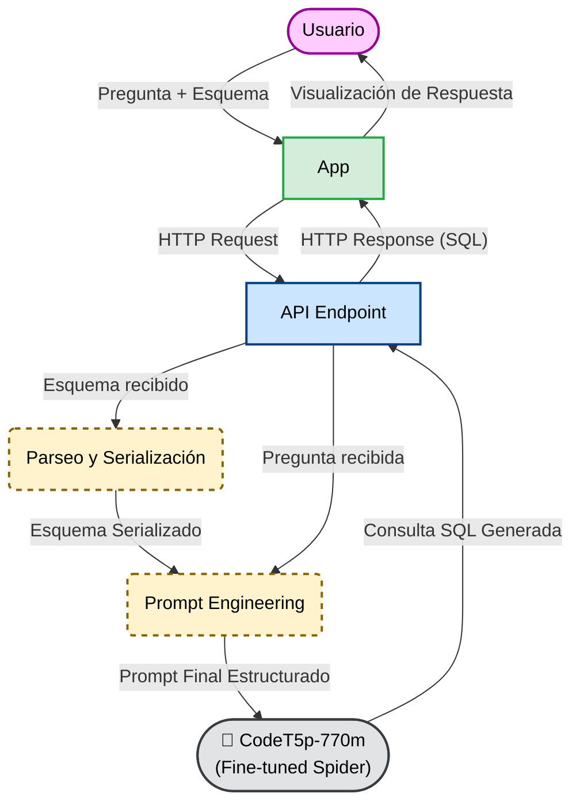

# Generador de Consultas SQL con CodeT5p

Este proyecto implementa un sistema de Text-to-SQL que permite a usuarios sin conocimientos técnicos generar consultas SQL complejas simplemente escribiendo preguntas en lenguaje natural. 

El modelo comprende esquemas de bases de datos con múltiples tablas, relaciones (claves primarias y foráneas), y genera automáticamente consultas que incluyen JOINs, agregaciones, subconsultas, GROUP BY y lógicas condicionales avanzadas.

El modelo base fue sometido a *fine-tuning* y evaluado utilizando el dataset **[Spider](https://yale-lily.github.io/spider)**, logrando un **Execution Accuracy del ~68.7%**.

## 🌐 Idioma Recomendado: Inglés
**Para obtener el máximo rendimiento, se recomienda formular las preguntas en Inglés.** Tanto el modelo base (`CodeT5p-770m`) como el dataset de entrenamiento (`Spider`) están construidos en ese idioma. Consultar en Español puede llegar a inferir en el resultado final.

## 🔄 Flujo de Ejecución en la App

Para garantizar la alineación estructural entre el entrenamiento y la producción, la aplicación realiza una transformación invisible pero importante entre lo que el usuario ingresa y lo que el modelo recibe.

### 1. Entrada del Usuario (Frontend)
El usuario ingresa a la aplicación web, escribe su pregunta en inglés y copia y pega el código DDL (Data Definition Language) de su base de datos desde un archivo `.sql` estándar.

**Pregunta del usuario:**
> *"How many students belong to the Computer Science department?"*

**Schema ingresado (SQL DDL estándar):**
```sql
CREATE TABLE department (
    id int PRIMARY KEY,
    name text
);

CREATE TABLE student (
    id int PRIMARY KEY,
    name text,
    department_id int,
    FOREIGN KEY (department_id) REFERENCES department(id)
);
```

### 2. Parseo y Serialización (Backend)
El modelo de IA no entiende sentencias `CREATE TABLE`. Por lo tanto, el backend de FastAPI intercepta este texto y, utilizando la librería `sqlglot` y expresiones regulares, lo traduce al formato con el que el modelo fue entrenado.

**Schema transformado internamente:**
```
department : number department_id (pk) , text name | student : number student_id (pk) , text name , number department_id | foreign keys: student.department_id = department.department_id
```

### 3. Generación del Prompt y Respuesta
El backend ensambla la pregunta y el esquema, enviándolos al modelo. Tras unos segundos, el transformer devuelve la consulta SQL.

**Prompt final enviado a CodeT5p:**
```
translate to SQL: How many students belong to the Computer Science department? | db_id: custom_db | schema: department : number department_id (pk) , text name | student : number student_id (pk) , text name , number department_id | foreign keys: student.department_id = department.department_id
```

**Salida generada**
```
SELECT count(*) FROM student AS T1 JOIN department AS T2 ON T1.department_id  =  T2.id WHERE T2.name  =  'Computer Science'
```

## 🧠 Tecnologías utilizadas

- **Frontend:** Reflex (Framework Python).
- **Backend:** FastAPI y Pydantic (API).
- **Modelo de IA:**
  - **CodeT5p-770m (Salesforce):** Modelo transformer encoder-decoder para código.
  - Fine-tuning sobre 8659 consultas del dataset Spider (166 bases de datos multidominio).

## 🏗️ Arquitectura del Sistema


## 📊 Resultados Oficiales
El modelo fue evaluado utilizando el [script oficial de Spider](https://github.com/taoyds/spider) (`evaluation.py` con `--etype all`).

| Dificultad | Execution Accuracy | Exact Match |
| :--- | :---: | :---: |
| **Easy** | 84.7% | 85.1% |
| **Medium** | 71.1% | 67.7% |
| **Hard** | 56.9% | 48.9% |
| **Extra Hard** | 44.0% | 36.7% |
| **TOTAL** | **68.67%** | **63.7%** |

### 🔍 Métricas
Para evaluar el rendimiento del modelo, nos basamos en dos métricas estándar:
* **Execution Accuracy (Precisión de Ejecución):** Mide si la consulta SQL generada por la IA devuelve *exactamente los mismos resultados* (las mismas filas y columnas) que la consulta original cuando se ejecuta contra la base de datos.
* **Exact Match (Coincidencia Exacta):** Mide si el SQL generado es sintácticamente idéntico (cláusula por cláusula) a la consulta de referencia o "gold query". Es una métrica mucho más estricta pero a veces engañosa, ya que en SQL existen múltiples formas de escribir una consulta diferente para obtener el mismo resultado correcto.

### 🛠️ Pruebas Manuales en Colab
Además del evaluador oficial, durante todo el proceso de entrenamiento en Google Colab usamos un evaluador casero. Esta herramienta nos permitió realizar un seguimiento iterativo, probando manualmente cómo el modelo mejoraba o empeoraba al aplicar diferentes técnicas (como el *Schema Pruning*), alterar hiperparámetros (como `num_beams`), o cambiar el formato del prompt en tiempo real antes de la evaluación final.

## 🔬 Experimentos
Durante el desarrollo, realizamos distintos experimentos con el objetivo de obtener el mejor modelo posible:

***1. Schema Pruning (Cross-Encoder) vs. Full Schema***
* **Hipótesis:** Usar un modelo semántico (`ms-marco-MiniLM-L-6-v2`) para filtrar tablas irrelevantes (Pruning) antes de pasarlas a CodeT5p reduciría la sobrecarga cognitiva del modelo y mejoraría el Accuracy.
* **Resultado:** El Accuracy cayó significativamente a ~57%. El filtro semántico eliminaba las "Tablas Puente", ya que sus nombres no solían aparecer en la pregunta del usuario, pero eran matemáticamente vitales para realizar los JOINs de Muchos-a-Muchos.
* **Conclusión:** Se demostró que el Transformer (CodeT5p) tiene la capacidad de atención suficiente para ignorar las tablas inútiles por sí solo. Es estrictamente necesario inyectar el esquema completo para no limitar el razonamiento en las dificultades *Hard* y *Extra Hard*.

***2. Inferencia Agresiva (10 Beams vs. 5 Beams)***
* **Hipótesis:** Aumentar los caminos de búsqueda a `num_beams=10` durante la evaluación daría un mayor abanico de opciones para sortear errores de sintaxis o lógica en queries difíciles.
* **Resultado:** La precisión no experimentó mejoras y se estancó en 67.6%, demostrando el "techo" del algoritmo de Beam Search (las opciones generadas del 6 al 10 carecen de confianza estadística y suelen ser alucinaciones forzadas).
* **Conclusión:** Se determinó que `num_beams=5` es el parámetro adecuado para producción, ya que garantiza alcanzar la máxima precisión matemática de la arquitectura mientras reduce el costo computacional y la latencia a la mitad.

***3. Evaluación de Arquitecturas Base***
* **Hipótesis:** Se evaluaron distintas familias de modelos Transformers (T5-base, T5-large, BART, CodeT5-base y CodeT5-large) para determinar cuál posee la mejor base de conocimiento para la tarea de Text-to-SQL.
* **Resultado:** Los modelos de propósito general (T5, BART) tuvieron dificultades severas con la sintaxis estricta de SQL y presentaban constantes alucinaciones de columnas. Las variantes de **CodeT5** superaron ampliamente a los demás en tiempos de convergencia y precisión.
* **Conclusión:** El pre-entrenamiento específico en código fuente le da a CodeT5 una ventaja. Se seleccionó `CodeT5p-770m` por ser el punto óptimo entre máxima capacidad de razonamiento relacional y viabilidad de entrenamiento en hardware estándar (GPU T4 en Google Colab).

***4. Sensibilidad al Prompt y Alineación Train-Inference***
* **Hipótesis:** Se probaron múltiples estructuras de Prompts para evaluar el impacto del "Prompt Engineering" en el Execution Accuracy usando el mismo modelo entrenado.
* **Resultado:** Se descubrió una altísima sensibilidad al formato del prompt. Alterar el orden de los elementos (ej. pasar de `tipo columna (pk)` a `columna (tipo)`) o agregar lenguaje natural extra en la fase de inferencia provocaba caídas en el rendimiento.
* **Conclusión:** El factor más determinante para el éxito en producción es la **estricta alineación Train-Inference**. El modelo debe recibir un DDL serializado exactamente con los mismos delimitadores rígidos (`translate to SQL: ... | db_id: ... | schema: ...`) con los que optimizó sus matrices durante el fine-tuning para que funcione correctamente.

***5. Pre-entrenamiento Intermedio (WikiSQL -> Spider)***
* **Hipótesis:** Realizar una fase de entrenamiento intermedio sobre el dataset **WikiSQL** antes de entrenar con Spider ayudaría al modelo a afianzar las bases de la sintaxis SQL, mejorando su rendimiento final.
* **Resultado:** El experimento no dio frutos e incluso mostró un rendimiento peor. WikiSQL está compuesto por consultas extremadamente simples (una sola tabla, sin JOINs, sin subconsultas). Al pre-entrenar con este dataset, el modelo generó un sesgo hacia consultas planas (olvidando su capacidad generativa compleja).
* **Conclusión:** Pre-entrenar con datasets de baja complejidad relacional penaliza el desempeño en entornos de bases de datos complejas. Es mucho más efectivo realizar el fine-tuning directo desde el modelo (CodeT5p) hacia el dataset (Spider).

## 🖥️ Entorno de Entrenamiento y Limitaciones de Hardware

El entrenamiento completo de este modelo se llevó a cabo utilizando **Google Colab** con una **GPU NVIDIA T4 (16GB VRAM)**. Esta infraestructura impuso importantes decisiones y limitaciones durante el desarrollo del proyecto:

* **Restricción de Parámetros:** La memoria VRAM limitada de la T4 nos impidió cargar y entrenar modelos de Lenguaje (LLMs) más grandes y modernos de la familia de los billones de parámetros (por ejemplo las versiones más pesadas de CodeT5+ de 2B/16B).
* **Selección del Modelo:** Esta restricción física fue el factor decisivo para elegir `CodeT5p-770m` (770 millones de parámetros), ya que era el modelo más inteligente que matemáticamente cabía en la memoria de la GPU.
* **Impacto en el Accuracy:** Aunque el modelo de 770M logró un excelente **68.67%** de Execution Accuracy demostrando una gran eficiencia, somos conscientes de que escalar el tamaño del modelo (utilizando hardware superior como GPUs más potentes) impactaría directa y positivamente en el porcentaje final, especialmente en las consultas *Extra Hard*.
* **Ventana de Contexto y Truncamiento del Esquema:** El modelo CodeT5p procesa un límite máximo estricto de tokens por inferencia (restringido a 512-1024 tokens debido a la memoria de la GPU). Dado que nuestra arquitectura inyecta el esquema completo de la base de datos en el prompt para maximizar el contexto relacional, las bases de datos masivas presentes en Spider (con decenas de tablas y cientos de columnas, correspondientes a los niveles *Hard* y *Extra Hard*) exceden esta ventana de contexto. Como resultado, el tokenizador trunca el final del prompt, dejando al modelo "ciego" ante las últimas tablas o claves foráneas. Este cuello de botella estructural explica gran parte de la caída de precisión en las métricas *Hard* y *Extra Hard* al evaluar esquemas gigantes.

## 📁 Estructura del Proyecto

```bash
texto-a-sql/
├── backend/
│   ├── api.py
│   ├── model.py
├── frontend/
│   ├── components/
│   ├── pages/
│   ├── state/
│   └── frontend.py
├── README.md
├── requirements.txt
└── rxconfig.py
```

## 🚀 Requisitos previos
- Python 3.10+
- pip (gestor de paquetes)

## ⚙️ Instalación paso a paso

**1. Clonar el repositorio**
```bash
git clone https://github.com/brunocontii/texto-a-sql
```

**2. Crear y activar entorno virtual**
```bash
python3 -m venv .venv
source .venv/bin/activate
```

**3. Instalar las dependencias**
```bash
pip install -r requirements.txt
```

**4. Ejecutar el proyecto**

En una terminal:
```bash
cd backend/
python api.py
# también con uvicorn api:app --reload
```

En otra terminal (ejecutar en la raiz del proyecto y dentro del entorno virtual):
```bash
reflex run
```
La aplicación corre en `http://localhost:3000/` por defecto.

### ⚠️ Nota importante sobre la primera ejecución
La primera vez que realices una consulta en la aplicación, el sistema tardará varios minutos en responder (dependiendo de tu conexión a internet). Esto es completamente normal y se debe a que el backend necesita descargar los pesos del modelo `CodeT5p-770m` desde los servidores de Hugging Face. 

Una vez finalizada esta descarga inicial, el modelo quedará guardado en la caché local de tu equipo y todas las consultas posteriores se generarán en cuestión de segundos.

## 👥 Equipo de Desarrollo
- Conti, Bruno  
- Gonzalez, Juan Cruz  
- Vollenweider, Erich  

*Universidad Nacional de Río Cuarto - Inteligencia Artificial*